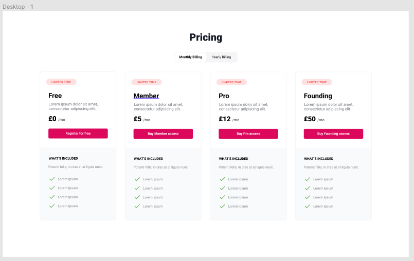
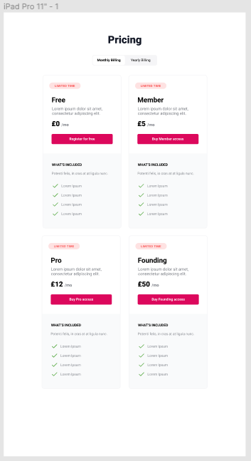
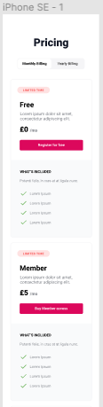
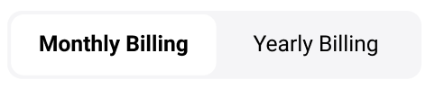

# junior-frontend-test
https://sifted.eu/jobs/junior-front-end-developer/

## What we are looking for
HTML/CSS
- Valid HTML structure
- Understanding of SVG and use of included assets
- Use of CSS grid / Flexbox
- Well structured and clean CSS

Javascript
- Good understanding of JS basics
  - Understanding of Javascript event handlers + functions

- Good use of git
  - Quality, frequent, sensible commits

## The Task
For the Sifted Junior Web Developer task: Please make a responsive webpage using the following [design](https://www.figma.com/file/lYwdJxRgjCwHlSmxxTtaFG/Sifted-FE-Tech-Test-Junior) as a guide.

### Git
Git clone our project:
- SSH: git@github.com:siftedeu/junior-frontend-test.git
- GH CLI: gh repo clone siftedeu/junior-frontend-test
- HTTPS: https://github.com/siftedeu/junior-frontend-test.git

### Design
https://www.figma.com/file/lYwdJxRgjCwHlSmxxTtaFG/Sifted-FE-Tech-Test-Junior

Once the page has been created. The task is to add some interactivity to the page. The toggle shown (Monthly / Yearly Billing) should alter the pricing show on each card, the design shows the exact pricing to display.

### JS Pricing Toggle
Please use - an event listener, controlling html elements and styling of the toggle
Calculations/business logic

## Your solution
When returning your solution to this test, please either:

- Make a sharable github repo (good for us to be able to see your projects progression on git)
- Zip up the code and email attach your solution